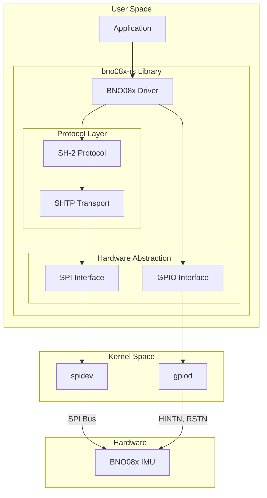
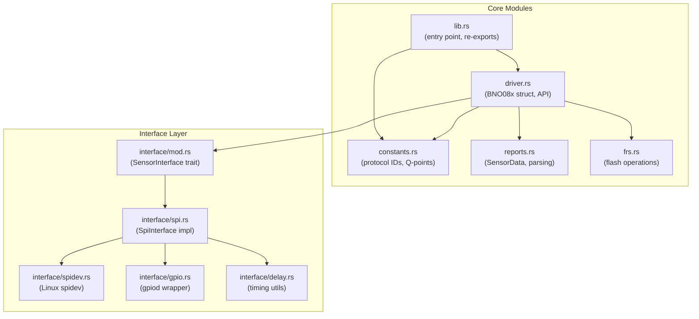
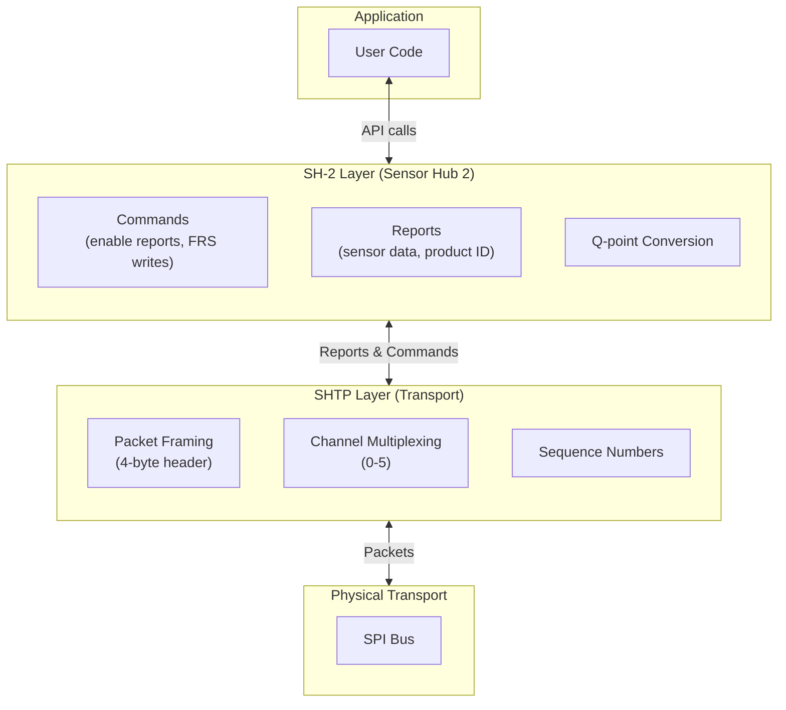
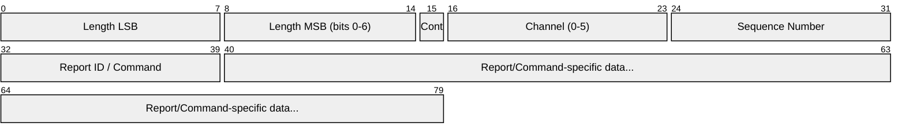
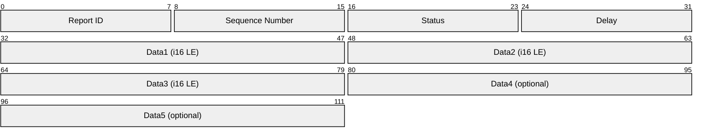

# Architecture

This document describes the architecture and design decisions of the BNO08x IMU driver.

## Overview

The BNO08x driver is a Rust userspace library that provides safe, ergonomic access to the BNO08x family of 9-axis Inertial Measurement Units (IMUs). The driver communicates with the sensor over SPI and uses GPIO for reset and interrupt handling.

## Design Principles

1. **Safety First**: Use Rust's type system to prevent common errors (buffer overflows, race conditions, etc.)
2. **Hardware Abstraction**: Provide clean abstractions that work across different hardware platforms
3. **Performance**: Minimize overhead and avoid unnecessary allocations in hot paths
4. **Testability**: Design components to be testable without physical hardware where possible
5. **Ergonomics**: Provide intuitive APIs that make common tasks easy

## System Overview

The following diagram shows the high-level architecture of the BNO08x driver, illustrating how the application, library, protocols, and hardware interfaces fit together:



**Key relationships:**

- **Application** uses the library's high-level API to read sensor data
- **BNO08x Driver** implements the SH-2 protocol for sensor commands and data parsing
- **SHTP** (Sensor Hub Transport Protocol) handles packet framing and channel multiplexing
- **SPI/GPIO Interfaces** abstract Linux kernel drivers for hardware communication
- **BNO08x IMU** communicates via SPI for data, GPIO for interrupt (HINTN) and reset (RSTN)

## Module Breakdown

The following diagram shows the internal module structure of the library:



### Core Modules

#### `lib.rs`

- Entry point for the library
- Defines top-level error types (`Error<CommE, PinE>`)
- Re-exports public interfaces and constants
- Exports sensor report ID constants for user convenience

**Key Types:**

```rust
pub enum Error<CommE, PinE> {
    Comm(CommE),           // Communication errors
    Pin(PinE),             // GPIO errors
    SensorUnresponsive,    // Sensor did not respond after reset
    BufferOverflow { packet_size, buffer_size },
    NoDataAvailable,       // Timeout waiting for HINTN
}
```

#### `driver.rs`

The main driver implementation containing:

- **`BNO08x<'a, SI>` struct**: Generic over `SensorInterface` type
  - State management (sequence numbers, buffers, sensor data)
  - Initialization and reset logic
  - Report enable/disable commands
  - Data accessors (quaternions, acceleration, etc.)
  - Callback management for sensor events

- **`DriverError<E>` enum**: Higher-level driver errors
  - `CommError(E)`: Sensor interface errors
  - `InvalidChipId(u8)`: Product ID mismatch
  - `InvalidFWVersion(u8)`: Unsupported firmware
  - `NoDataAvailable`: Expected data not received

- **SHTP Protocol Implementation**:
  - Packet encoding/decoding
  - Channel management (command, executable, control, reports)
  - Sequence number tracking
  - Error list handling

- **Sensor Data Processing**:
  - Q-point fixed-point to float conversion
  - Report ID handling for different sensor types
  - Timestamp tracking for each report type

**Constructor Methods:**

```rust
// Generic constructor with any SensorInterface
pub fn new_with_interface(sensor_interface: SI) -> Self

// SPI with explicit GPIO chip and pin numbers
pub fn new_spi(spidevice, hintn_gpiochip, hintn_pin, 
               reset_gpiochip, reset_pin) -> io::Result<Self>

// SPI with GPIO pin symbol lookup (e.g., "IMU_INT", "IMU_RST")
pub fn new_spi_from_symbol(spidevice, hintn_pin, reset_pin) -> io::Result<Self>
```

#### `constants.rs`

All protocol constants, report IDs, and configuration values:

- **Buffer sizes**: `PACKET_SEND_BUF_LEN` (256), `PACKET_RECV_BUF_LEN` (2048)
- **SHTP channel definitions**: Command (0), Executable (1), Hub Control (2), Sensor Reports (3)
- **Sensor report IDs**: 0x01-0x09 for various sensor types
- **FRS status codes**: For flash record system operations
- **Q-point tables**: `Q_POINTS` and `Q_POINTS2` arrays for fixed-point conversion

**Helper Functions:**

```rust
// Convert Q-point fixed-point to f32
pub fn q_to_f32(q_val: i16, q_point: usize) -> f32

// Convert f32 to Q-point bytes (little-endian)
pub fn f32_to_q(f32_val: f32, q_point: usize) -> [u8; 4]

// Get FRS status description string
pub fn frs_status_to_str(status: u8) -> &'static str
```

#### `reports.rs`

Sensor report handling structures:

- **`SensorData`**: Storage for all sensor data with update methods
- **`ReportState<'a, T>`**: Track enabled reports, timestamps, and callbacks
- **`ReportParser`**: Helper for parsing raw bytes from sensor reports
- **Type aliases**: `ReportCallback<'a, T>` and `ReportCallbackMap<'a, T>`

#### `frs.rs`

Flash Record System operations:

- **`FRS_TYPE_SENSOR_ORIENTATION`**: Record type for orientation configuration
- Functions to build FRS write requests and data packets
- Quaternion to Q30 format conversion for sensor orientation

### Interface Layer

#### `interface/mod.rs`

Defines the `SensorInterface` trait and common utilities:

```rust
pub trait SensorInterface {
    type SensorError;
    
    fn setup(&mut self) -> Result<(), Self::SensorError>;
    fn write_packet(&mut self, packet: &[u8]) -> Result<(), Self::SensorError>;
    fn read_packet(&mut self, recv_buf: &mut [u8]) -> Result<usize, Self::SensorError>;
    fn read_with_timeout(&mut self, recv_buf: &mut [u8], max_ms: usize) 
        -> Result<usize, Self::SensorError>;
    fn send_and_receive_packet(&mut self, send_buf: &[u8], recv_buf: &mut [u8]) 
        -> Result<usize, Self::SensorError>;
    fn requires_soft_reset(&self) -> bool;
}
```

**Internal Utilities:**

- `SensorCommon::parse_packet_header()`: Parse SHTP packet header to extract length
- Constants: `PACKET_HEADER_LENGTH` (4), `MAX_CARGO_DATA_LENGTH` (2044)

This abstraction allows for different communication backends (SPI, I2C, etc.) without changing the core driver logic.

#### `interface/spi.rs`

SPI-specific implementation:

- **`SpiControlLines<SPI, IN, RSTN>`**: Encapsulates SPI device + GPIO pins
  - `spi`: SPI device for data transfer
  - `hintn`: Hardware interrupt input pin
  - `reset`: Reset output pin

- **`SpiInterface<SPI, IN, RSTN>`**: Implements `SensorInterface` for SPI
  - Hardware interrupt monitoring (HINTN pin - active low)
  - Reset sequencing (low → high transition)
  - Two-phase packet transfer (header read, then full packet)
  - Error recovery with timeout handling

**Key Implementation Details:**

- `hintn_signaled()`: Returns true when HINTN is low (sensor has data)
- `wait_for_sensor_awake()`: Blocks up to specified milliseconds for HINTN
- `block_on_hintn()`: Similar blocking wait with cycle count
- `requires_soft_reset()`: Returns `false` for SPI (uses hardware reset)

#### `interface/spidev.rs`

Linux spidev wrapper with custom traits:

- **`Transfer` trait**: Bidirectional SPI transfer
- **`Write` trait**: Unidirectional SPI write

- **`SpiDevice`**: Wraps Linux `spidev` for SPI communication
  - Configured for SPI_MODE_3
  - 80 kHz clock speed
  - 8 bits per word, MSB first

#### `interface/gpio.rs`

GPIO abstraction using the gpiod library:

- **`PinState` enum**: `Low` or `High` with conversion traits
- **`OutputPin` trait**: `set_low()`, `set_high()`, `set_state()`
- **`InputPin` trait**: `is_high()`, `is_low()`
- **`GpiodOut`**: Output pin implementation using gpiod `Lines<Output>`
- **`GpiodIn`**: Input pin implementation using gpiod `Lines<Input>`

All GPIO operations use the "imu-driver" consumer string for identification.

#### `interface/delay.rs`

Timing utilities:

- `delay_ms(ms: usize)`: Blocking millisecond delay using `std::thread::sleep`

## GPIO Pin Mapping

The driver supports two methods for specifying GPIO pins, enabling portability across different hardware platforms.

### Symbol-Based GPIO Lookup (Recommended)

The `new_spi_from_symbol()` constructor allows GPIO pins to be specified by their symbolic names rather than chip/pin numbers. This makes the driver portable across different hardware platforms—only the device tree needs to define the appropriate GPIO line names.

```rust
// Portable: works on any platform with correctly named GPIO lines
let imu = BNO08x::new_spi_from_symbol("/dev/spidev1.0", "IMU_INT", "IMU_RST")?;
```

The driver iterates through all GPIO chips on the system, searching for lines matching the specified names. This decouples the application from specific hardware pin assignments.

### Explicit GPIO Specification

For cases where symbolic names aren't available, pins can be specified by chip and number:

```rust
// Hardware-specific: requires knowledge of exact GPIO chip and pin numbers
let imu = BNO08x::new_spi(
    "/dev/spidev1.0",
    "/dev/gpiochip4", 31,  // HINTN: gpiochip4, pin 31
    "/dev/gpiochip5", 1,   // RSTN: gpiochip5, pin 1
)?;
```

### Device Tree Configuration

For the symbol-based lookup to work, the Linux device tree must define `gpio-line-names` for the relevant GPIO controllers. Hardware designers and BSP developers configure this based on how the IMU is wired.

**Example: Maivin 2 Device Tree**

The [Maivin 2 device tree overlay](https://github.com/MaivinAI/maivin-overlays/blob/main/overlays/maivin2.dts) defines the IMU GPIO pins:

```dts
/* Pin controller definition */
&iomuxc {
    pinctrl_imu: imu {
        fsl,pins =
            <MX8MP_IOMUXC_SAI3_TXFS__GPIO4_IO31  0x184>, /* SODIMM 44 - IMU_INT */
            <MX8MP_IOMUXC_SAI3_TXD__GPIO5_IO01   0x184>, /* SODIMM 46 - IMU_RST */
            <MX8MP_IOMUXC_SAI3_RXD__GPIO4_IO30   0x184>; /* SODIMM 48 - IMU_BOOT */
    };
};

/* GPIO line naming for gpiochip4 */
&gpio4 {
    gpio-line-names =
        /* ... other pins ... */
        "IMU_BOOT", /* SODIMM_48 - GPIO4_IO30 */
        "IMU_INT";  /* SODIMM_44 - GPIO4_IO31 */
};

/* GPIO line naming for gpiochip5 */
&gpio5 {
    gpio-line-names =
        "SODIMM_42",
        "IMU_RST",  /* SODIMM_46 - GPIO5_IO01 */
        /* ... other pins ... */
};
```

### IMU GPIO Signals

| Signal | Direction | Purpose |
|--------|-----------|---------|
| `IMU_INT` (HINTN) | Input | Hardware interrupt - sensor asserts low when data is available |
| `IMU_RST` (RSTN) | Output | Reset control - toggle low to reset the sensor |
| `IMU_BOOT` | Output | Boot mode selection (active low for normal operation) |

### Portability Benefits

This architecture enables:

1. **Hardware Independence**: Application code uses symbolic names, not pin numbers
2. **BSP Responsibility**: Hardware-specific pin mappings are defined in the device tree
3. **Runtime Discovery**: The driver discovers GPIO assignments at runtime
4. **Multiple Platform Support**: Same binary works on different boards with different wiring

## Protocol Stack

The driver implements a two-layer protocol stack defined by CEVA/Hillcrest Labs:



- **SH-2 (Sensor Hub 2)**: Application-layer protocol defining sensor reports, commands, FRS operations, and Q-point data formats
- **SHTP (Sensor Hub Transport Protocol)**: Transport-layer protocol providing packet framing, channel multiplexing, and sequence tracking

## SHTP Protocol Details

### Packet Structure



### Communication Channels

| Channel | Name            | Purpose                                    |
|---------|-----------------|-------------------------------------------|
| 0       | COMMAND         | SHTP control commands and responses        |
| 1       | EXECUTABLE      | Device-level commands (reset)              |
| 2       | HUB_CONTROL     | Sensor hub control (enable reports, etc.)  |
| 3       | SENSOR_REPORTS  | Sensor data input reports (non-wake)       |
| 4       | WAKE_REPORTS    | Wake input sensor reports (not implemented)|
| 5       | GYRO_ROTATION   | Gyro rotation vector (not implemented)     |

### Sensor Reports

The driver supports multiple report types, each with a unique ID:

| Report ID | Sensor Type                  | Q-Point | Q-Point2 (accuracy) |
|-----------|------------------------------|---------|---------------------|
| 0x01      | Accelerometer                | Q8      | -                   |
| 0x02      | Gyroscope (calibrated)       | Q9      | -                   |
| 0x03      | Magnetic Field (calibrated)  | Q4      | -                   |
| 0x04      | Linear Acceleration          | Q8      | -                   |
| 0x05      | Rotation Vector              | Q14     | Q12                 |
| 0x06      | Gravity                      | Q8      | -                   |
| 0x07      | Gyroscope (uncalibrated)     | Q9      | -                   |
| 0x08      | Game Rotation Vector         | Q14     | -                   |
| 0x09      | Geomagnetic Rotation Vector  | Q14     | Q12                 |

### Data Conversion

Sensor data is transmitted in Q-point fixed-point format. The driver converts to `f32`:

```rust
fn q_to_f32(q_val: i16, q_point: usize) -> f32 {
    (q_val as f32) / (1 << q_point) as f32
}
```

Example conversions:

- Q8: 256 → 1.0 (accelerometer, linear accel, gravity)
- Q9: 512 → 1.0 (gyroscope)
- Q14: 16384 → 1.0 (quaternions)
- Q4: 16 → 1.0 (magnetic field)

### Input Report Structure

Each sensor input report follows this format:



## Initialization Sequence

1. **Hardware Reset**: Toggle RSTN pin (high → low → high with 2ms delay)
2. **Wait for HINTN**: Sensor asserts interrupt when ready (up to 200ms)
3. **Read Advertisement**: Sensor sends unsolicited advertisement packet
4. **Read Reset Response**: Sensor confirms reset completion
5. **Soft Reset** (I2C only): Send reset command for interfaces requiring it
6. **Verify Product ID**: Request and validate sensor product ID (0xF9/0xF8)
7. **Enable Reports**: Configure desired sensor reports with update rates

```rust
// Typical initialization
imu.init()?;                                    // Hardware setup + product ID verification
imu.enable_report(SENSOR_REPORTID_ROTATION_VECTOR, 100)?;  // 100ms interval
```

## Callback System

The driver supports registering callbacks for sensor events:

```rust
imu.add_sensor_report_callback(
    SENSOR_REPORTID_ROTATION_VECTOR,
    "my_callback".to_string(),
    |imu| {
        let quat = imu.rotation_quaternion().unwrap();
        println!("Quaternion: {:?}", quat);
    }
);

// Later, remove if needed
imu.remove_sensor_report_callback(SENSOR_REPORTID_ROTATION_VECTOR, "my_callback".to_string());
```

Callbacks are stored in a `HashMap` per report type (keyed by string name) and invoked when new data arrives via `handle_sensor_report_update()`.

## Message Handling

The driver provides several methods for processing incoming sensor data:

```rust
// Handle up to max_count messages with timeout
imu.handle_messages(timeout_ms, max_count) -> u32

// Handle all available messages until none remain
imu.handle_all_messages(timeout_ms) -> u32

// Handle exactly one message
imu.handle_one_message(max_ms) -> u32

// Consume messages without processing (drain queue)
imu.eat_all_messages()
imu.eat_one_message() -> usize
```

## Thread Safety

**Note**: The current implementation is **NOT thread-safe**. The `BNO08x` struct does not implement `Send` or `Sync` due to:

- GPIO/SPI handles that are not thread-safe
- Mutable internal state (buffers, sequence numbers)
- Callback closures with lifetime parameters

For multi-threaded use, wrap the driver in a `Mutex` or `Arc<Mutex<_>>`.

## Error Handling

Errors are propagated using `Result` types at two levels:

### Low-Level Errors (`lib.rs`)

```rust
pub enum Error<CommE, PinE> {
    Comm(CommE),           // SPI/communication errors
    Pin(PinE),             // GPIO errors
    SensorUnresponsive,    // Sensor did not respond after reset
    BufferOverflow { packet_size, buffer_size },
    NoDataAvailable,       // Timeout waiting for HINTN
}
```

### Driver-Level Errors (`driver.rs`)

```rust
pub enum DriverError<E> {
    CommError(E),          // Wrapped sensor interface errors
    InvalidChipId(u8),     // Product ID mismatch
    InvalidFWVersion(u8),  // Unsupported firmware
    NoDataAvailable,       // Expected data not received
}
```

## FRS (Flash Record System)

The driver supports writing configuration to the sensor's flash memory:

```rust
// Set sensor orientation using quaternion
imu.set_sensor_orientation(qi, qj, qk, qr, timeout_ms)?;
```

FRS write sequence:

1. Send write request with record type and length
2. Wait for `FRS_STATUS_WRITE_READY` response
3. Send data in 2-word (8-byte) chunks with offset
4. Wait for `FRS_STATUS_WRITE_COMPLETE` or `FRS_STATUS_WRITE_FAILED`

## Performance Considerations

### Buffer Sizes

- **Send buffer**: 256 bytes (`PACKET_SEND_BUF_LEN`) - sufficient for all commands
- **Receive buffer**: 2048 bytes (`PACKET_RECV_BUF_LEN`) - handles largest packets
- **Max cargo data**: 2044 bytes (`MAX_CARGO_DATA_LENGTH`)

### Timing

- **SPI speed**: 80 kHz (configured for reliable communication)
- **SPI mode**: MODE_3 (CPOL=1, CPHA=1)
- **Report rates**: Configurable from 1 Hz to 1 kHz (gyro-limited)
- **Post-reset wait**: 200ms for sensor to assert HINTN
- **Polling interval**: Recommended 50ms for main loop
- **Inter-packet delay**: 5ms between SPI transfers

### Memory Allocation

- All buffers are stack-allocated (no heap allocations in hot path)
- Callbacks use boxed closures (one-time allocation at registration)
- HashMap used for callback storage (keyed by string)

### Typical Usage Pattern

```rust
fn main() -> io::Result<()> {
    let mut imu = BNO08x::new_spi_from_symbol("/dev/spidev1.0", "IMU_INT", "IMU_RST")?;
    imu.init().expect("Failed to initialize IMU");
    
    imu.enable_report(SENSOR_REPORTID_ROTATION_VECTOR, 100)?;
    imu.enable_report(SENSOR_REPORTID_ACCELEROMETER, 300)?;
    
    imu.add_sensor_report_callback(
        SENSOR_REPORTID_ROTATION_VECTOR,
        "print".to_string(),
        |imu| println!("{:?}", imu.rotation_quaternion()),
    );
    
    loop {
        imu.handle_messages(10, 20);
        delay_ms(50);
    }
}
```

## Testing

The codebase includes unit tests for:

- **`constants.rs`**: Q-point conversion roundtrips, channel constants, report IDs, buffer sizes
- **`reports.rs`**: SensorData updates, ReportParser byte parsing, input report handling
- **`interface/mod.rs`**: Packet header parsing with various lengths and continuation flags

Run tests with:

```bash
cargo test
```

## References

### Sensor Documentation

- [BNO08x Datasheet](https://www.ceva-ip.com/wp-content/uploads/BNO080_085-Datasheet.pdf) - Hardware specifications, electrical characteristics, and pin descriptions
- [SHTP Reference Manual](https://www.ceva-ip.com/wp-content/uploads/SH-2-SHTP-Reference-Manual.pdf) - Transport layer protocol: packet structure, channel definitions, sequence numbering, and framing (implemented in `interface/mod.rs` and `interface/spi.rs`)
- [SH-2 Reference Manual](https://www.ceva-ip.com/wp-content/uploads/SH-2-Reference-Manual.pdf) - Application layer protocol: sensor report IDs, Q-point formats, FRS operations, command/response definitions (implemented in `driver.rs`, `constants.rs`, `frs.rs`)

### Rust Crate Documentation

- [gpiod Documentation](https://docs.rs/gpiod/latest/gpiod/) - Linux GPIO character device interface used for HINTN and RSTN pins
- [spidev Documentation](https://docs.rs/spidev/latest/spidev/) - Linux SPI device interface used for sensor communication

---

For implementation questions, see [CONTRIBUTING.md](CONTRIBUTING.md) or open a [GitHub Discussion](https://github.com/EdgeFirstAI/bno08x-rs/discussions).
